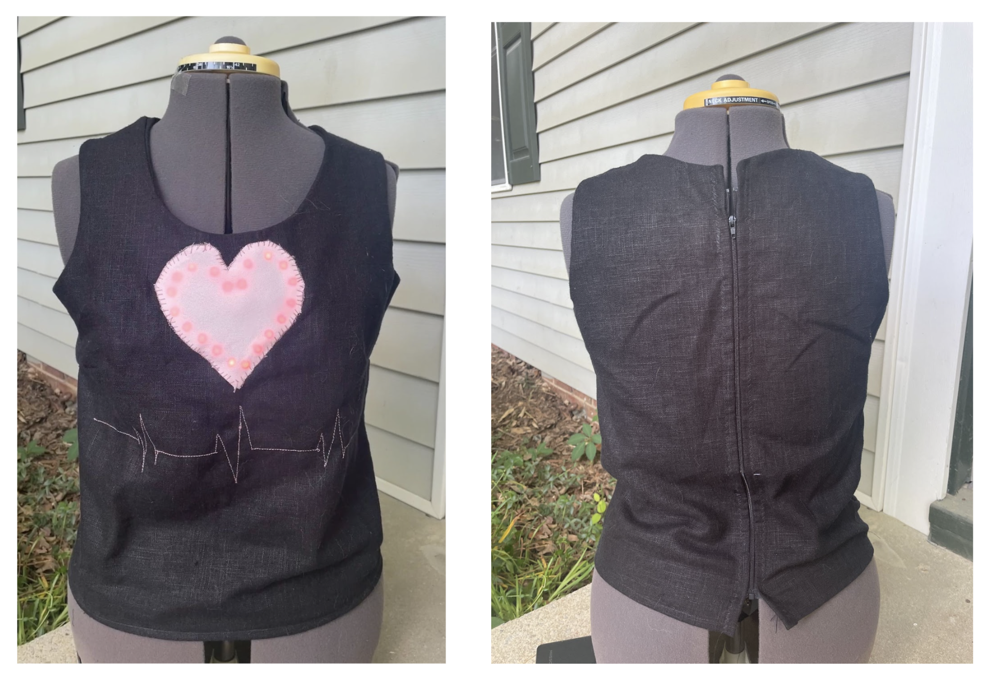
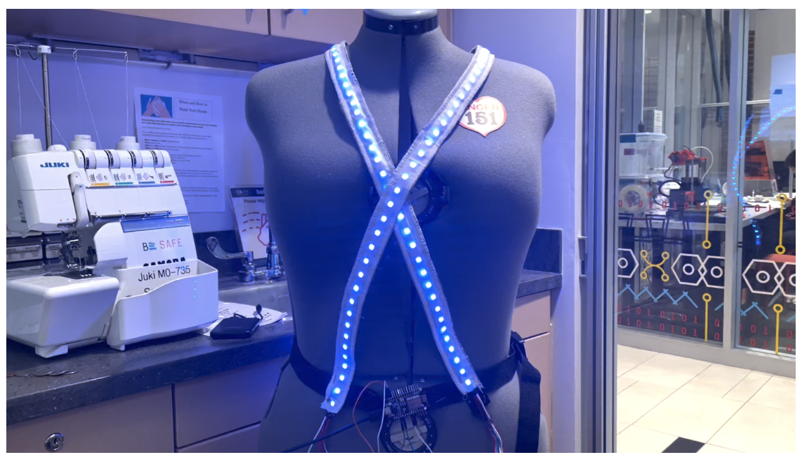

# E-Textiles: Integrating Sensing and LEDs into Wearables

These files were created for APPL 495: Mentored Research in Applied Physical Sciences, under the guidance of Dr. Goldberg. 
The details of this project can be found in the E-textiles Final Report pdf in this repository. 
This was a great oppotunity to pratice my microelectronic skills, but also to learn the extra challenges faced when integrating textiles and design - of which there are many.

## Heartbeat Sensor 

This project was a vest with an embedded heartbeat sensor and LEDs displaying the heartbeats of the wearer. 
Here is the heartbeat sensor and reciever I used: https://www.adafruit.com/product/1077

## LED Network

For this project, I created a set of two harnesses embedded with LEDs, which are controlled by Arduino microcontrollers to change colors depending on their distance from one another. 
There are two files: blue_scan_network and red_scan_network. Both of these are the same code, but with different output messages and different color settings. 

